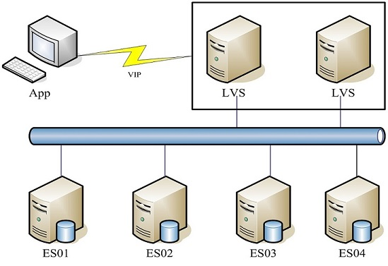
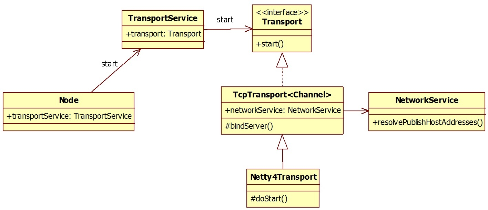
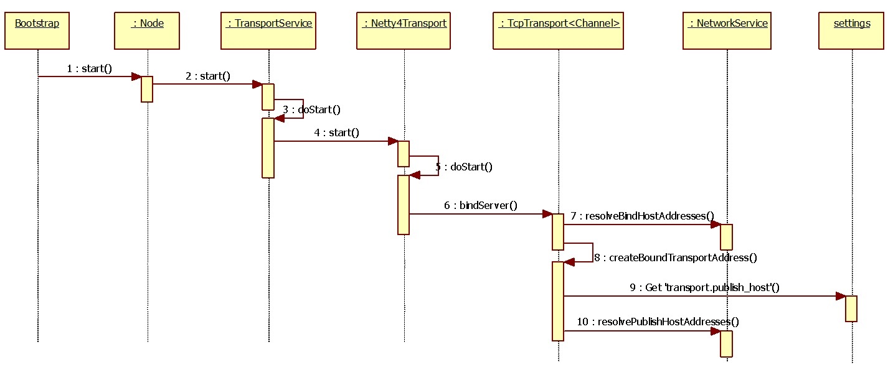

# ElasticSearch + LVS构建 ES 集群时配置项transport.publish_host导致的问题


## 问题描述:
基于LVS + ElasticSearch 5.6.8 构建电商系统需要的ES集群，部署示意图如下：  
  
按照此方案进行部署的系统，投入生产后一切运行正常。  


在一个新启动的电商项目中一如既往的按照这个部署架构申请主机、部署应用后，启动ElasticSearch应用，  
测试发现ES节点间无法连接形成集群。如下图所示：  
  

查看ES的log发现了如下报错信息：
```
[2024-06-28T17:27:31,587][WARN ][o.e.d.z.ZenDiscovery     ] [aa_cnc-03] failed to connect to master [{aa_cnc-02}{1PKaGjHXS5-5I-9uhBlOQA}{Dkj21DhzSFaSioiJz4LkYg}{xxx.xx.40.60}{xxx.xx.40.60:9300}], retrying...
org.elasticsearch.transport.ConnectTransportException: [aa_cnc-02][xxx.xx.40.60:9300] handshake failed. unexpected remote node {aa_cnc-03}{qQftJ7zXSteU7Q8JZAyRTA}{4HpHGhklRBGWjPrYXn-w-g}{xxx.xx.40.60}{xxx.xx.40.60:9300}
  at org.elasticsearch.transport.TransportService.lambda$connectToNode$3(TransportService.java:346) ~[elasticsearch-5.6.8.jar:5.6.8]
  at org.elasticsearch.transport.TcpTransport.connectToNode(TcpTransport.java:474) ~[elasticsearch-5.6.8.jar:5.6.8]
  at org.elasticsearch.transport.TransportService.connectToNode(TransportService.java:342) ~[elasticsearch-5.6.8.jar:5.6.8]
  at org.elasticsearch.transport.TransportService.connectToNode(TransportService.java:329) ~[elasticsearch-5.6.8.jar:5.6.8]
  at org.elasticsearch.discovery.zen.ZenDiscovery.joinElectedMaster(ZenDiscovery.java:458) [elasticsearch-5.6.8.jar:5.6.8]
  at org.elasticsearch.discovery.zen.ZenDiscovery.innerJoinCluster(ZenDiscovery.java:410) [elasticsearch-5.6.8.jar:5.6.8]
  at org.elasticsearch.discovery.zen.ZenDiscovery.access$4100(ZenDiscovery.java:82) [elasticsearch-5.6.8.jar:5.6.8]
  at org.elasticsearch.discovery.zen.ZenDiscovery$JoinThreadControl$1.run(ZenDiscovery.java:1188) [elasticsearch-5.6.8.jar:5.6.8]
  at org.elasticsearch.common.util.concurrent.ThreadContext$ContextPreservingRunnable.run(ThreadContext.java:575) [elasticsearch-5.6.8.jar:5.6.8]
  at java.util.concurrent.ThreadPoolExecutor.runWorker(ThreadPoolExecutor.java:1149) [?:1.8.0_361]
  at java.util.concurrent.ThreadPoolExecutor$Worker.run(ThreadPoolExecutor.java:624) [?:1.8.0_361]
  at java.lang.Thread.run(Thread.java:750) [?:1.8.0_361]
```

## ES集群配置信息
ElasticSearch 版本 5.6.8 ；  
两台Liunx主机做LVS服务器 40.61 和 40.62 VIP是 40.60 ；  
因为是轻量的ES搜索应用所以部署了4台ES服务器 40.86~89 ；  
LVS配置9200的端口转发到40.86~89上。  

elasticsearch.yml的配置内容：
```
node.master: true
node.data: true
node.ingest: true
bootstrap.memory_lock: true
thread_pool.index.size: 5
thread_pool.index.queue_size: 1000
thread_pool.search.size: 24
thread_pool.search.queue_size: 3000
thread_pool.get.size: 24
thread_pool.get.queue_size: 1000
http.enabled: true

cluster.name: TEST_ES_CLUSTER
node.name: dev_esnode-01

path.data: /opt/es/elasticsearch/data
path.logs: /opt/es/elasticsearch/eslogs

network.host: 0.0.0.0
http.port: 9200

discovery.zen.ping.unicast.hosts: ["xxx.xx.40.86", "xxx.xx.40.87", "xxx.xx.40.88", "xxx.xx.40.89"]
discovery.zen.minimum_master_nodes: 3

http.cors.enabled: true
http.cors.allow-origin: "*"
```

## 问题结论
elasticsearch.yml中缺少了 transport.publish_host 配置项导致的上述问题  
在yml中增配置项，例如 40.86 节点上增加 transport.publish_host: xxx.xx.40.86 后  
ES启动正常。问题消失。

### 注:
transport.publish_host的用途：
在 Elasticsearch 中，transport.publish_host 是一个高级网络配置参数，专门用于定义节点间内部通信（Transport协议）对外公布的地址  
transport.publish_host 的作用是告诉集群中的其他节点：“如果你想和我进行内部通信，请使用这个地址”  
默认回退机制：如果你没有显式配置 transport.publish_host，Elasticsearch 会依次回退查找 transport.host，如果也没有，则使用 network.publish_host 的值  


## 问题分析过程
   
出问题的这套系统并非第一次采用这种ES架构部署，之前的系统都是运行正常的，所以排除了部署方案不合理的嫌疑。  
综合比较后发现:  
运行正常的系统在项目上线前规划主机资源时VIP和LVS放在IP段的最后，也就是说ES主机IP地址值要小于LVS和VIP的地址值。  
而出问题的这套系统由于一些客观原因VIP和LVS的地址在ES主机地址之前。  
即  
```
VIP:xxx.xx.40.60		
LVS:xxx.xx.40.61~62
ES:xxx.xx.40.86~89
```
而ES日志报错信息中也出现了VIP的身影。  
connect to master [{aa_cnc-02}{1PKaGjHXS5-5I-9uhBlOQA}{Dkj21DhzSFaSioiJz4LkYg}{xxx.xx.40.60}{xxx.xx.40.60:9300}], retrying...  
所以IP的问题应该就是元凶了。根据错误日志提示的调用栈结合代码分析，发现了问题的根源：   
ElasticSearch集群之间通讯是基于transport协议，通讯默认端口为9300。  
ES启动之后会做两件事情：一.获取ES节点间内部通信的地址，并建立监听；第二就是申请加入ES集群。  
问题就出在第一部分获取ES节点间内部通信的地址的处理逻辑上，下图为这部分代码的核心类图：   
  
主要的逻辑交互如下图所示：  
  
在TcpTransport::createBoundTransportAddress获取地址时有2部分逻辑：  
1.publishHosts = TransportSettings.PUBLISH_HOST.get(settings).toArray(Strings.EMPTY_ARRAY); (从yml配置中获取transport.publish_host)  
2.publishInetAddress = networkService.resolvePublishHostAddresses(publishHosts);  
```
if (publishHosts == null || publishHosts.length == 0) {
  if (GLOBAL_NETWORK_PUBLISHHOST_SETTING.exists(settings) || GLOBAL_NETWORK_HOST_SETTING.exists(settings)) {
	//GLOBAL_NETWORK_PUBLISHHOST_SETTING = Setting.listSetting("network.publish_host", GLOBAL_NETWORK_HOST_SETTING, Function.identity(), Property.NodeScope);
	//GLOBAL_NETWORK_HOST_SETTING = Setting.listSetting("network.host", Arrays.asList(DEFAULT_NETWORK_HOST), Function.identity(), Property.NodeScope);
	//DEFAULT_NETWORK_HOST = "_local_";
	//优先取yml配置项 network.publish_host 没有的话取 network.host 
	publishHosts = GLOBAL_NETWORK_PUBLISHHOST_SETTING.get(settings).toArray(Strings.EMPTY_ARRAY);
  }
  else {
    ...
  }
  ...
  if (addresses.length == 1 && addresses[0].isAnyLocalAddress()) {
    //若是一个统配地址，则取本机所有的IP
    //由于yml中没有配置network.publish_host 而 network.host值为 0.0.0.0
    //所以会走这个分支逻辑
    HashSet<InetAddress> all = new HashSet<>(Arrays.asList(NetworkUtils.getAllAddresses()));
	addresses = all.toArray(new InetAddress[all.size()]);
  }
  
  if (addresses.length > 1) {
	/**
	由于采用LVS方式部署集群，会将VIP绑定在ES主机的本地回环接口上，形如：
    [god@EACV040086L ~]$ ifconfig
    ens192: flags=4163<UP,BROADCAST,RUNNING,MULTICAST>  mtu 1500
            inet xxx.xx.40.86  netmask 255.255.254.0  broadcast xxx.xx.41.255
            ether 00:50:56:93:65:9f  txqueuelen 1000  (Ethernet)
            RX packets 10899717  bytes 3409042635 (3.1 GiB)
            RX errors 0  dropped 1440  overruns 0  frame 0
            TX packets 10613716  bytes 1943829610 (1.8 GiB)
            TX errors 0  dropped 0 overruns 0  carrier 0  collisions 0
    
    lo: flags=73<UP,LOOPBACK,RUNNING>  mtu 65536
            inet 127.0.0.1  netmask 255.0.0.0
            loop  txqueuelen 1000  (Local Loopback)
            RX packets 558718  bytes 82234721 (78.4 MiB)
            RX errors 0  dropped 0  overruns 0  frame 0
            TX packets 558718  bytes 82234721 (78.4 MiB)
            TX errors 0  dropped 0 overruns 0  carrier 0  collisions 0
    
    lo:0: flags=73<UP,LOOPBACK,RUNNING>  mtu 65536
            inet xxx.xx.40.60  netmask 255.255.255.255
            loop  txqueuelen 1000  (Local Loopback)
	所以ES主机上会有两个IP地址，一个是ES主机的实际IP，另一个是本地回环接口上绑定的VIP。
	而在出问题的系统上，VIP的值要小于ES主机IP值，因此经过如下逻辑排序后，取出的第一个地址就是VIP
	进而出现了日志中提示的信息
	这也是为什么之前的系统是运行正常的(因为VIP规划在了ES主机之后, 排序后第一个IP是实际主机IP。)
	*/
	List<InetAddress> sorted = new ArrayList<>(Arrays.asList(addresses));
	NetworkUtils.sortAddresses(sorted);
	addresses = new InetAddress[]{sorted.get(0)};
  }
  
  return addresses[0]; //取第一个地址
}
```
  
在第二部分逻辑：申请加入申请加入ES集群。
```
public class ZenDiscovery ... {
  private void innerJoinCluster() {
    ...
    //由于yml中有node.master: true 配置项，所以找到的master节点的IP为VIP: xxx.xx.40.60
    masterNode = findMaster();
    ...
    if (clusterService.localNode().equals(masterNode)) {
      ...
    }
    else {
      ...
      final boolean success = joinElectedMaster(masterNode);
      ...
    }
  }
  
  private boolean joinElectedMaster(DiscoveryNode masterNode) {
    try {
      // first, make sure we can connect to the master
      transportService.connectToNode(masterNode);
    } catch (Exception e) {
      logger.warn((Supplier<?>) () -> new ParameterizedMessage("failed to connect to master [{}], retrying...", masterNode), e);
      return false;
    }
  }
}
```
  
## 总结
至此真想大白：ES集群节点间基于transport协议进行通讯前，要获取一个本机实际的IP，优先从配置项transport.publish_host,没有的话取  
network.host, 若配置的不是即使地址则系统会从本机地址中取最小的那个地址。  
因此当绑定在本地回环接口上的VIP值小于实际IP时，就会被取出当做通讯IP使用，造成连接失败。这样就使得ES间无法连通。  
  
解决方法就是在yml中增加配置项transport.publish_host即可。  
