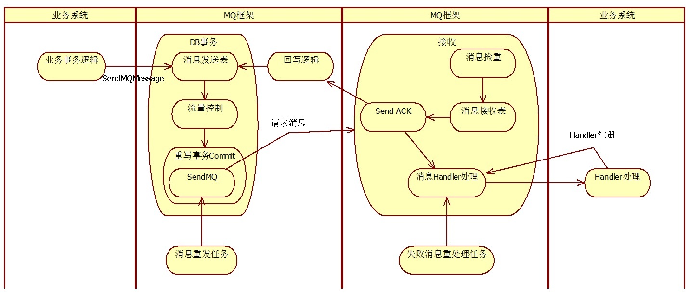
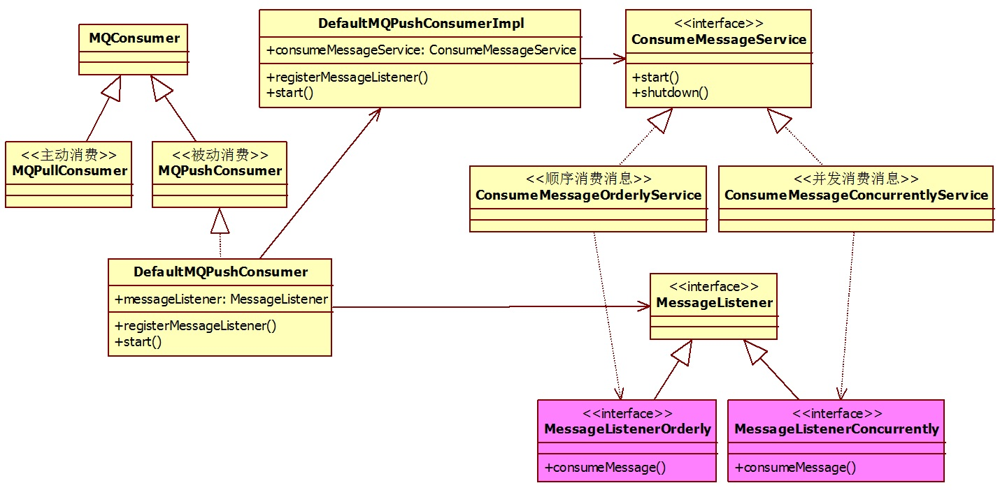
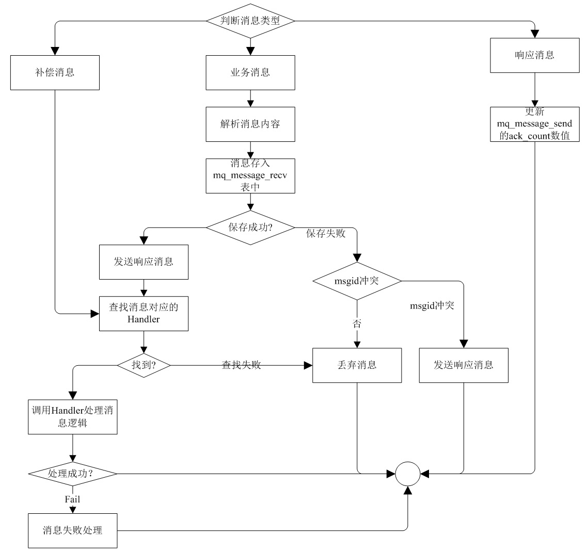
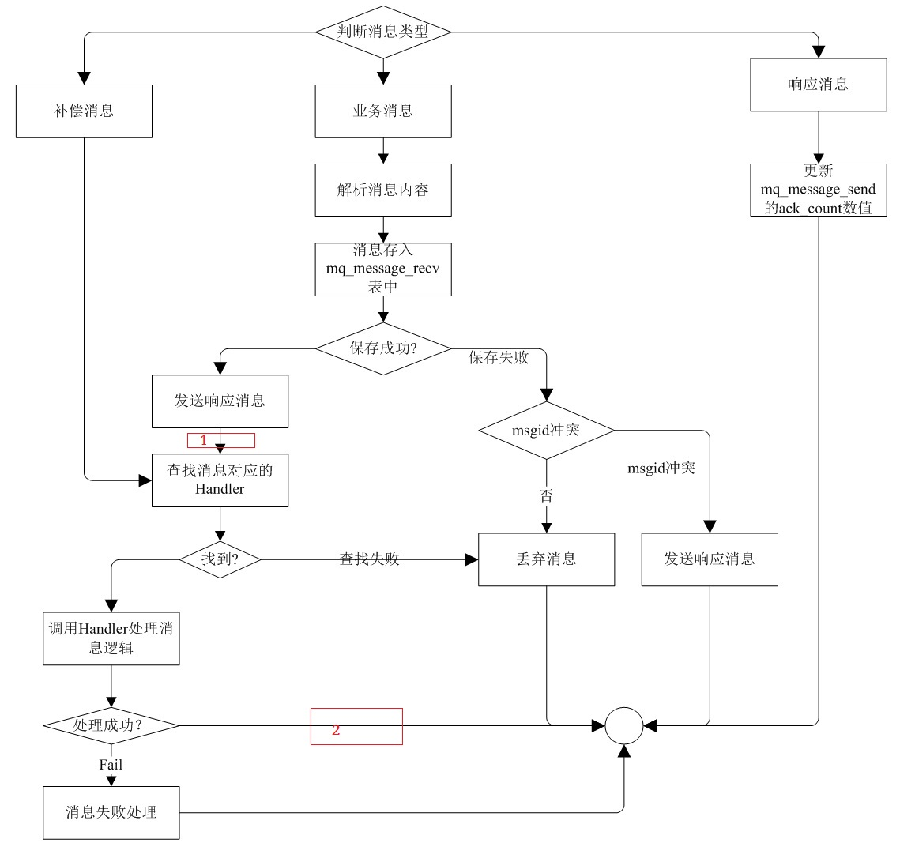
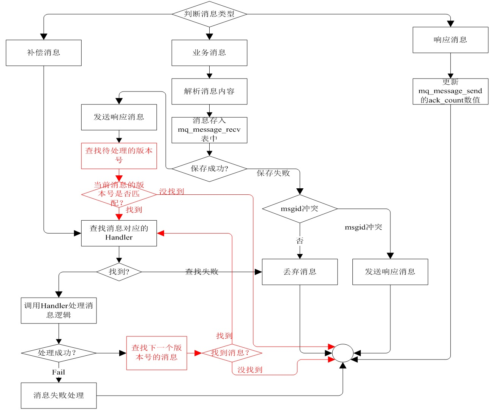
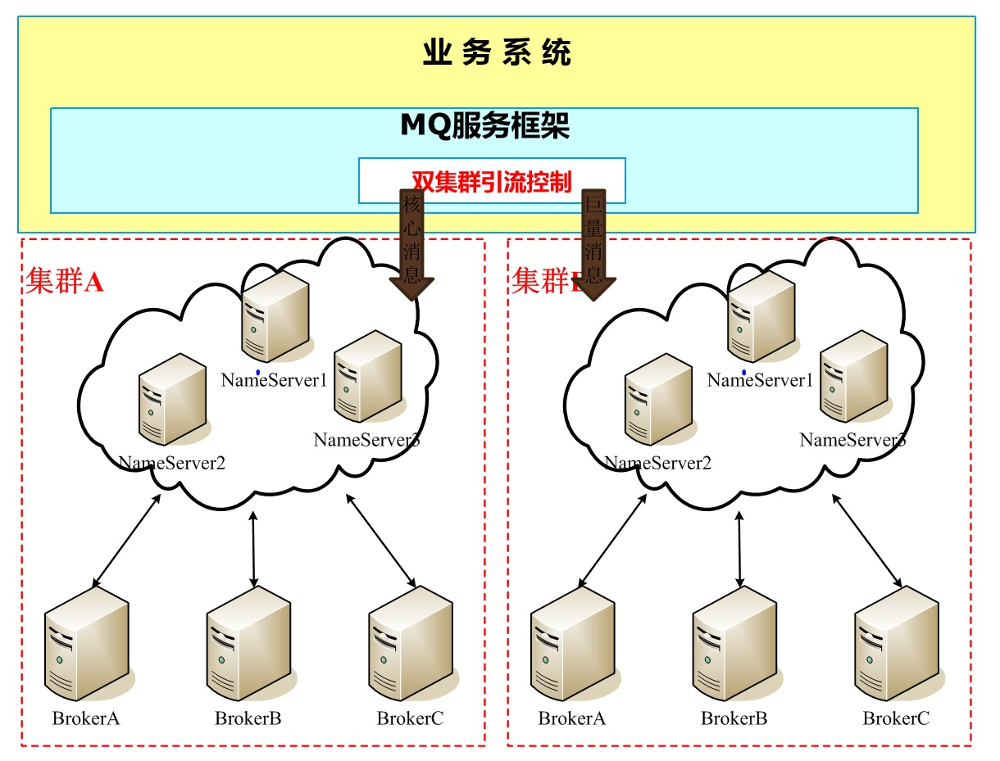
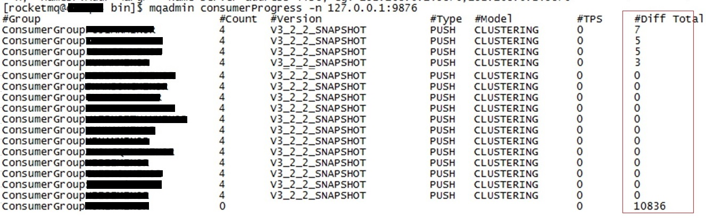

# 本地消息表 + RocketMQ构建MQ消息框架
  
## 1.业务背景：  
1.在跨系统数据交互中，WebService 接口是常规的实现方式。然而，即便采用了集群部署，在系统升级发布期间仍难以完全规避数据推送失败的风险。此外，批量数据推送往往会对系统造成显著的性能开销，尤其在业务高峰期，极易引发资源争抢，进而影响正常业务的处理效率。  
  
2.ERP系统根据业务部门的需求，调拨发货会涉及多个系统间的交互。需要提供一种系统间有效可靠的交互方式，且要便于开发人员使用。  
      
针对上述业务需求与系统性能痛点，我们引入了RocketMQ 消息中间件进行架构解耦与消峰处理；同时引入本地消息表机制，来确保分布式环境下的数据最终一致性问题。  
  
## 2.架构思路： 
1.RocketMQ中间件提供了事务消息，用以确保消息生产者的本地事务与消息的成功投递这两个操作要么同时成功，要么同时失败，从而实现最终一致性。但如何能确保消息一定能够被对端接收和处理，这对于RocketMQ中间件而言是一个盲区。因此在我们的设计中采用本地消息的理念来完成消息的100%投递成功。而框架只使用了RocketMQ中间件的普通消息功能，其余的一致性功能由本地消息表机制来完成。  
    
2.简化开发者使用MQ消息的流程，让开发者忽略所有MQ消息的底层逻辑，以便可以专注于业务逻辑的处理。  
  
基于这个设计思路，MQ框架的实现如下图所示：  
   
  
  
## 3.整体方案  

### 3.1 基本框架(开发人员视角)：
MQ框架暴露给开发人员三个接口，用以完成MQ消息的发送，MQ消息类型注册和处理。  
   
- 接口1:消息发送接口   
在业务逻辑需要的位置调用此接口完成消息的发送，开发人员无需关注发送的底层逻辑；只需要从业务上关注该接口的参数如何定义即可。  
```
/**
 * @targetName 消息接收方
 * @msgType 消息类型，由开发人员视业务需求而定
 * @requData 消息内容，由开发人员视业务需求而定
 * @orderNo 消息对应的原始单据ID (与消息本身无关，主要为了运维使用)
 * @orderType 消息对应的原始单据类型
 */
@Transactional(rollbackFor = Exception.class)
public String SendMQMessage(String targetName, String msgType, Object requData, String orderNo)

@Transactional(rollbackFor = Exception.class)
public String SendMQMessage(String targetName, String msgType, Object requData, String orderNo, String orderType)
```
该接口有两种调用方式，差别在于入参orderType(消息对应的原始单据类型)。设计参见"顺序消息"，当调用传入orderType时表示启用顺序消息功能。   
  
- 接口2:消息处理接口  
在消息接收方系统中需要实现一个MQRequTransProcHandler的子类来完成消息的处理。  
```
//MQ消息处理Handler
public class XXXHandler extends MQRequTransProcHandler {
    
	@Override
	protected abstract void performHandler() throws Exception {
		//获取MQ消息内容
		//public Object getRequObject()
		//public String getFrom() //消息来源
		
		//TODO 业务逻辑
	}
}
```
  
- 接口3:消息处理Handler注册接口  
完成消息类型与Handler的映射。当系统接收到此消息类型的消息时框架会唤起Handler类进行对应业务逻辑的处理。    
```
<!-- 消息处理注册 -->
<property name="handlers">
	<map>
		<entry key="XXX_BUSI_MQ" value="***.XXXHandler" />
	</map>
</property>
```


### 3.2 应答机制  
MQ框架通过应答机制确保消息一定可以被对端系统接收到。  
  
当MQ消息被推送到接收方系统后，框架首先完成消息的解析与存储，无误之后会给发送方系统发送一个响应消息，发送完之后，框架会唤起注册的Handler来完成消息的处理。 
     
MQ消息的发送方，通过MQ框架将消息成功发送给MQ服务器后；框架中的消息重发任务会定时检测该消息是否接收到对方反馈的响应消息，若在一定时长后没有接收到 响应消息，MQ框架会以一种递增间隔时长的方式（例如：第一次间隔30秒钟没有接收到ACK消息；第二次间隔60秒；第三次间隔90秒...）将这个消息重新发送一次。直到接收到对端反馈的响应消息。   
   
### 3.3 消息的存储
设计了两张表
CREATE TABLE `mq_message_send` (...); 和 CREATE TABLE `mq_message_recv` (...); 用以存储发送的消息和接收到的消息，两张表的结构相同。  
  
表字段信息如下：
```
`logno` int(12) NOT NULL AUTO_INCREMENT, --主键
`target` varchar(64) DEFAULT NULL,       --消息(接收方/接收方)编码
`msg_type` varchar(64) DEFAULT NULL,     --消息类型编码
`msg_id` varchar(128) DEFAULT NULL,      --消息ID
`busi_obj` clob,                         --消息内容
`order_nos` varchar(512) DEFAULT '-',    --原始单据号
`order_type` varchar(512) DEFAULT '-',   --原始单据类型(用于顺序消息处理)
`msg_version` int(4) DEFAULT 0,          --消息版本号(用于顺序消息处理)
`send_count` int(4) DEFAULT 0,           --消息重发送的次数
`ack_count` int(4) DEFAULT 0,            --接收到对端响应消息的次数
`status` varchar(4) DEFAULT 'N',         --消息处理状态
`fail_count` int(4) DEFAULT 0,           --消息处理失败的次数
`except_obj` text,                       --消息处理的异常信息
`source` varchar(128) DEFAULT ' ',       --消息(接收/接收)处理主机IP
`create_time` timestamp DEFAULT CURRENT_TIMESTAMP, 	--消息生成时间
`create_by` varchar(64) DEFAULT NULL,              	--操作人
`update_time` timestamp,                           	--消息操作更新时间(重发/重处理)
`update_by` varchar(64) DEFAULT NULL,              	--更新操作人
`close_flag` varchar(8) DEFAULT 'N',              	--消息的关闭状态
```
  

### 3.4 消息幂等问题:  
- 消息响应机制确保了消息送达的可靠性，但在特殊的条件下(如：接收端系统负载高处理缓慢、接收端与MQ服务器网络出现问题)会触发消息重复任务导致同一个业务消息被多次发送，因此需要解决MQ消息的幂等问题。  
  
- MQ框架采用了消息ID + 数据库唯一索引的方式来解决消息幂等问题。
  
- 消息ID的设计: 采用“IP地址+Java进程ID+消息目的编码+时间戳+9位序列号”来标记消息ID(实现代码如下所示)，业务系统每触发一次SendMQMessage，框架会生成一个消息ID，交互过程中不论是消息的重发、响应消息还是消息的重新处理消息ID不变。  
    
```
private static String MyIP = "";
private static long serial = 1;

public synchronized static long getSerialID() {
	long sn = serial;
	
	serial++;

	if (serial >= 999999999)
		serial = 1;
	
	return sn;
}
	
public static String getLocalIp() {
	//获取本机的IP地址
	return MyIP;
}

public static String getPID() {
	//return 当前Java进程的ID
}

protected String getMessageID(String targetName) {
	
	if(localHostIp == null || localHostIp.length() == 0) {
		localHostIp = getLocalIp().replaceAll("\\.", "_") + "_" + getPID();
	}
	
	try {
		Date dd = new Date();
		SimpleDateFormat sdf = new SimpleDateFormat("yyyyMMddHHmmss");
		String sdate = sdf.format(dd);

		java.text.DecimalFormat format = new java.text.DecimalFormat("000000000");
		String keyID = sdate + format.format( getSerialID() );

		return localHostIp + targetName + keyID;
	} catch (Exception e) {
		e.printStackTrace();
	}

	return localHostIp + targetName + "20250215155322000000001";
}
```
该设计确保了消息ID的唯一性且可便于运维。  
  
- CREATE UNIQUE INDEX mqmsg_recv_ind_unique ON mq_message_recv (msg_id); 通过该索引来解决幂等问题。(具体参见3.6.1节描述)


### 3.5 发送端设计  

#### 3.5.1 消息发送  
   
业务端通过调用SendMQMessage进行MQ消息的发送，发送时需要指定消息类型、消息对象、消息接收方编码、业务单据号、单据类型（顺序消息必须指定该参数）。在SendMQMessage中完成了两件事情:  
  
- 1.将消息的相关内容insert到mq_message_send表中。 
```
public class MQServiceContext extends ... {
	private static final ThreadLocal<Set<MQRecord>> mqRecordSet = new ThreadLocal<Set<MQRecord>>();
	
	@Transactional(rollbackFor = Exception.class)
	public String SendMQMessage(String targetName, String msgType, Object requData, ...) {
		String msgid = getMessageID(targetName);
		//TODO : message info insert into mq_message_send;
		addMQRecord(record);
	}
	
	//缓存消息
	protected boolean addMQRecord(MQRecord record) {
		if (MQServiceContext.mqRecordSet.get() == null) {
			MQServiceContext.mqRecordSet.set(new HashSet<MQRecord>());
		}

		MQServiceContext.mqRecordSet.get().add(record);
		
		return true;
	}
}
```
   
- 2.将消息内容缓存起来，目的是为了在事务提交后立刻将消息发送给MQ消息服务器。具体的发送动作是在事务管理器中完成的。
  
#### 3.5.2 事务管理器改造
改造事务管理器的目的是为了可以在事务提交的试课就可以将需要发送的MQ消息发送给MQ服务器。逻辑代码如下：  
```
public class MQServiceContext extends ... {

    private static final ThreadLocal<Set<MQRecord>> mqRecordSet = new ThreadLocal<Set<MQRecord>>();
	
    public static void txCommit() {
		
        if( mqRecordSet.get() != null && mqRecordSet.get().size() > 0) {
            printLog("mqRecordSet size:" + mqRecordSet.get().size());

            for(MQRecord rec : mqRecordSet.get()) {
                try {
                    //发送MQ消息 to MQ服务器
                    MQAsynService.getInstance().SendRequest(rec);
                }
                catch(Exception e){
                    //出现异常,无须理会
                    e.printStackTrace();
                }
            }
        }

        mqRecordSet.set(null);
    }
	
    public static void txRollback() {
        //清理
        mqRecordSet.set(null);
    }
	
}

//事务管理器改造
public class ERPTransactionManager extends DataSourceTransactionManager {
    @Override
    protected void doCommit(DefaultTransactionStatus status) {
        try {
            super.doCommit(status);
            MQServiceContext.txCommit();
        }
        catch(Exception e) {
            MQServiceContext.txRollback();
            throw e;
        }
    }
	
    @Override
    protected void doRollback(DefaultTransactionStatus status) {
        try {
            super.doRollback(status);
        }
        finally {
            MQServiceContext.txRollback();
        }
    }
}
```
注意一个问题：在事务管理器doCommit执行发送消息给MQ服务器时，存在发送失败的情况，上述逻辑中没有对这个发送失败做任何处理，只做了捕捉异常，打印异常信息。  
这样处理有两个原因：
- 简化事务管理器的逻辑：在事务管理器doCommit添加过多的处理逻辑回导致执行时长的增加且会增大出错的几率。
- 对于发送异常的消息交由框架的"发送补偿"逻辑进行处理。
    
#### 3.5.3 发送补偿
考虑如下的场景：  
- 场景1：在ERPTransactionManager::doCommit调用txCommit发送MQ消息给MQ服务器时由于网络发生瞬间抖动导致发送失败。  
- 场景2：接收端在拉取消息成功且尚未处理消息时，系统宕机导致消息丢失。  
- 场景3：接收端线程池全部被占满，导致无法拉取MQ服务器上的消息或者无法发送响应给消息的发送端。  
    
场景1和场景2是两种典型的消息发送失败和消息接收失败的场景；场景3虽然暂时没有出现失败的迹象，但长时间没有回馈响应消息，发送端无法判断是处理堵塞还是投递异常，也认为是消息投递失败。   
通过发送补偿任务可以补偿上述问题发生时消息投递失败的情况。它的核心逻辑就是巡检没有送达的消息(上述3种场景)，然后重新发送。  
  
- 1.未送达消息巡检
```
select * from mq_message_send 
where ack_count=0 
 and now()-create_time > (send_count * 30 + 60)秒 
 and close_flag='N'
 and send_count < 20
```
send_count是消息重发送的次数，初值为0。ack_count接收到对端响应消息的次数，初值为0。   
巡检消息的初试状态为：消息生成后等待1分钟(now()-create_time > 60秒)还未接收到响应即会触发消息重发。  
后续按每重发一次后检测时长累积增加30秒的方式进行巡检。  
增加send_count < 20条件是为了预防不可预知的异常导致一直无法收回反馈消息。
  
- 2.重发: 利用上述的事务+消息的机制进行重发。这样可以确保重发动作与重发计数(send_count)的一致。  
```
@Transactional(rollbackFor = Exception.class)
public String reSendMQ(MQRecord record) {

	//利用事务管理器发送消息
	if (addMQRecord(record)) {
		//更新消息的发送次数
		update mq_message_send set send_count = send_count + 1 where msg_id = record.msgid;
	}
}
```
  
#### 3.5.4 限流控制  
限流的目的是为了防止消息洪峰引发的资源过载。RocketMQ消息中间件本身提供了服务端限流和客户端限流两个维度限流功能。   
服务端限流主要用于保护底层机器资源（计算、存储、网络带宽等）不被过载。当客户端请求速率达到上限或集群存储压力过大时，服务端会触发限流。  
客户端限流是业务侧为了控制消费速率、保护下游依赖（如数据库、第三方接口）而主动采取的措施。  
  
本设计方案中的限流功能是属于客户端限流的范畴。基于系统的业务特性以及运维方面的考虑，MQ框架没有使用RocketMQ消息中间件提供限流功能，而是在MQ框架中叠加了一层功能来实现客户端的限流功能。  

- 限流的粒度：最小可以按照消息类型控制速度。  
  
如下限流配置解读：  
类型OUT_TYPE_POT_SEND的消息发送给ERP_SALE系统10分钟内最多可以发送40个消息；发给其他系统限制每10分钟发送50个消息。  
类型OUT_AUDITYES_REJ_WMS的消息1分钟内最多可以发送15个消息。  
```
<flowctrl msgtype="OUT_TYPE_POT_SEND" timeUnit="MM" timeFactor="10" flowFactor="50" enable="1">
	<target code="ERP_SALE" timeUnit="MM" timeFactor="10" flowFactor="40" enable="1"/>
</flowctrl>
<flowctrl msgtype="OUT_AUDITYES_REJ_WMS" timeUnit="MM" timeFactor="1" flowFactor="15" enable="1">
</flowctrl>
```

- 限流的位置：在消息发送端进行限流。  

```
//缓存消息
protected boolean addMQRecord(MQRecord record) {
    if(MQMsgFlowCtrl.flowCtrl(msg.getTarget(), msg.getRequType())) {
        if (MQServiceContext.mqRecordSet.get() == null) {
            MQServiceContext.mqRecordSet.set(new HashSet<MQRecord>());
        }

        MQServiceContext.mqRecordSet.get().add(record);
    }
    else {
        StringBuffer sb = new StringBuffer();
        sb.append("=>target:");
        sb.append(msg.getTarget());
        sb.append(", busiType:");
        sb.append(msg.getRequType());
        sb.append(", msgID:");
        sb.append(msg.getKeyID());
        sb.append(" flowctrl limit !");
		
        System.out.println(sb.toString());
    }

	return true;
}
```
  
- 限流逻辑
```
//MQ消息发送策略控制Bean
public class MsgSendStrategyBean {
    private Date startTime = new Date(); // 计时开始时间
    private String topicName; // 对应名称，不区分*
    private String busiType; // 消息类型
    private String timeUnit; // 时间单位 MM(分钟,默认) HH小时
    private int timeFactor = 0; // 时间
    private long flowFactor = 0; // 消息限流的数量 0标识不限制
    private long alreadyNum = 0; // 已经发送的数量
    ...
}

//限流控制的处理
public class MQMsgFlowCtrl {
    //KEY = busiType + target
    protected static Map<String, MsgSendStrategyBean> flowCtrlMap = 
    		Collections.synchronizedMap(new HashMap<String, MsgSendStrategyBean>());
    
    public static void init() {
        //TODO:read config to flowCtrlMap
    }
    
    //true:表示消息可以发送 false:表示要限流
    public static boolean flowCtrl(String target, String busiType) {
        String key1 = busiType + "_" + target;
		String key2 = busiType + "_*";
        
        MsgSendStrategyBean bean1 = flowCtrlMap.get(key1);
        MsgSendStrategyBean bean2 = flowCtrlMap.get(key2);
        
        if(bean1 == null && bean2 == null) {
           //没有配置信息，不限流
            return true;
        }
        Date d2 = new Date();
        if(bean1 != null) {
            return ctrl(d2, bean1);
        }
        if(bean2 != null) {
            return ctrl(d2, bean2);
        }
        return false;
    }
    
    private static boolean ctrl(Date d2, MsgSendStrategyBean bean) {
        
        //=0表示不做流量控制
        if(bean.getFlowFactor() == 0) {
            return true;
        }
        
        long timeFactor = 0;
        //timeFactor = 通过bean.timeUnit和bean.timeFactor计算控流时长(单位:秒)
        
        long diff = d2.getTime() - bean.getStartTime().getTime();
        long timeDiff = diff / 1000;
        
        if(timeDiff >= timeFactor) {
            //TODO : 超过指定的时间间隔，则重新计数
            return true;
        }
        else {
            //TODO : bean.alreadyNum累加
            if(bean.alreadyNum > bean.lowFactor()) {
                //已经超过限制
                return false;
            }
            else {
                return true;
            }
        }
        
    }
```

  
#### 3.5.5 响应消息的接收
MQ框架接收响应消息的底层逻辑同接收业务消息的底层逻辑是一致的，详见3.6.1接收消息处理流程。MQ框架接收到响应消息后，只做一件事情：  
```
update mq_message_send set ack_count = ack_count + 1 where msg_id = record.msgid;
```
即要累加当前消息已经接收到的响应消息的个数。  
在这个逻辑中会遇到这样的特殊场景：框架接收到响应消息在执行update时系统出现异常(若宕机)导致更新ack_count失败。该场景不会对消息的最终处理造成影响，这是因为：  
- 1.没有更新ack_count，若ack_count=0则之后会触发消息重发。若ack_count已经不为0，则当前的异常没有任何影响。 
- 2.重发的消息在对端接收到之后，会再次反馈响应消息。幂等的设计不会导致该消息的重复处理。  
- 3.框架再次接收响应之后会更新ack_count的计数。  
  
对于这种特殊场景可以通过  
select count(*) from mq_message_send where ack_count != 0 and ack_count != send_count  
来统计和监测。  

### 3.6 接收端设计  

#### 3.6.1 接收消息处理流程  
RocketMQ提供了Push和Pull两种消费消息的模式，框架采用了Push模式来消费消息。Push模式下有MessageListenerOrderly（顺序消费监听器）和MessageListenerConcurrently（并发消费监听器）两种消费者处理消息的接口。MQ框架采用了MessageListenerConcurrently，用以提升消息的消费速度。  
  
相关类图如下：  
  
  
MessageListenerConcurrently::consumeMessage被唤起后的处理流程如下所示：  
  
  
Handler处理：MQ框架唤起Handler进行消息处理时就会启动一个DB事务，事务中完成2件事情：  
- 1.消息对应的业务逻辑处理（由开发人员根据消息的业务逻辑定制开发）
- 2.update mq_message_recv set status='Y', closeFlag='Y' where msg_id=? and closeFlag='N' and status='N'(消息处理完了，要关闭该消息)
  
消息失败处理(即Handler调用异常时):  
update mq_message_recv set status='E', failcount=failcount+1 where msg_id=? and closeFlag='N' and status='N'  
  
整个接收处理流程有3个逻辑涉及数据库操作：1)保存接收到的数据、2)Handler处理和3)消息失败处理；三处数据库逻辑操作是三个独立的事务。  
  
#### 3.6.2 重处理补偿
Handler处理失败的原因有很多，可大致分为两类：正常原因和非正常原因。    
- 1.所谓正常原因指的是：由于基础配置数据错误、业务单据错误或者是代码逻辑错误导致的处理失败，此类原因导致的错误的特点是在没有人工干预的情况下，问题不可能得到修正。
- 2.非正常原因指的是由于系统临时的波动（比如加锁失败、链路异常等）导致Handler处理失败，此类问题的特点是临时波动消除后，若再次调用Handler的逻辑很大几率上会处理成功。
- 3.在3.6.1节"接收消息处理"秒速的逻辑中在理论上存在如下问题：当Handler处理失败后在执行消息失败逻辑时，系统异常导致update失败。出现此问题后消息的状态为 close_flag='N' (待管理) and status='N' (待处理)，这也需要补偿处理一下。
  
在业务实践中场景2发生的概率较大，场景3发生的几率很小但是也会发生。这两类场景需要通过补偿任务进行修复，即重处理补偿。  
  
补偿巡检：巡检的目的是为了探测是否出现了需要进行重处理补偿的消息，巡检是基于mq_message_recv表完成。
  
close_flag='N' and status='E' and fail_count <= 50 (fail_count的判断是为了剔除场景1)  
  
巡检获取需要重处理补偿的消息后，框架没有单独启动新的线程池来处理，而是利用的RocketMQ客户端的消费线程池，做法很简单只需要给自己发送一个补偿消息触发即可。上述流程图中的“补偿消息”分支正式这个逻辑的体现。  
  
在理论上重处理补偿时也存在幂等问题：比如消息A  
- T1时刻:消息A的状态为：close_flag='N' and status='E' and fail_count=1。  
- T2时刻:被补偿巡检探测到。发送补偿消息，进入重处理流程。  
- T3时刻:此时T2时刻的逻辑还没有执行完，下一轮的巡检又开始了，又会捕获到消息A，旋即幂等问题出现。  
  
解决方案有三个：  
- 1.调用进入Handler时，框架首先对该消息加nowait锁，这样第二次重处理补偿会因锁失败退出补偿流程。  
- 2.加nowait锁成功后判断消息的close_flag和status的状态，状态为(close_flag='N' and status='E')才能进入补偿流程。 
- 3.根据消息类型将重处理补偿任务分成三组，并根据实际消息统计到的Handler执行时长来调整补偿任务的运行间隔。 
  
重处理补偿任务还需要处理 close_flag='N' and status='N'，具体的处理有如下几种：
- 1.根据消息类型将重处理补偿任务分成三组，并根据实际消息统计到的Handler执行时长来调整补偿任务的运行间隔。 
- 2.结合监控系统进行处理:出现此场景时会伴随着系统的宕机异常，那么监控系统一定会监控到，当系统恢复时将这些异常消息状态status调整为(status='E')即可。  
- 3.在重处理补偿巡检中增加一个巡检条件：close_flag='N' and status='N' and now()-create_time > 120秒 (120秒时一个阈值，要根据实际业务场景进行调整)  
  
业务实践中我们采用的是1+2组合解决这类问题。
  
### 3.7 顺序消息
顺序消息是对消息的发送和消费顺序有严格要求的高级消息。某些业务会有这样的场景，比如:  
- 电商订单状态流转：同一个订单的“创建订单”、“订单支付”、“订单退款”、“物流更新”等消息必须按序处理，否则会导致订单状态机崩溃或财务对账异常。  
- 基于canal检查数据变化发出的消息下游系统要严格按照消息的发出顺序进行处理。  
- 金融撮合交易：在证券、股票交易中，对于出价相同的交易单，必须严格按照“先出价先交易”的 FIFO 原则处理。  

RocketMQ中有对顺序消息的处理逻辑：
- 1.必须要将需要顺序处理的消息投递到同一个Topic的同一个MessageQueue中
- 2.消费端需注册 MessageListenerOrderly 监听器来消费消息。
  
实际的业务场景中出现顺序消息多是在一个DB事务中发出多个业务消息，并且要求这多个消息要严格按照发送顺序执行。  
比如：CRM创建客户资料时会因其业务需求在创建资料事务中将创建逻辑分成两段基础信息创建和信息更新，这样它给ERP系统会发送两个消息：创建资料消息和变更资料消息。因此也就要求ERP要先执行资料创建，然后执行资料变更；若ERP处理顺序有错就会导致业务逻辑的错误。  
此类顺序消息在实际业务中的特点是：场景非常少（消息数量上比较少），但是对应的业务是基础的，一旦出错影响比较大。  

MQ框架基于上述业务特性，设计了顺序消息的处理逻辑：  
1.顺序消息从业务上以单据为单位进行控制，具体逻辑以单据号+单据类型+消息接收目标三个信息来构造的数据结构来控制。   
   
2.设立版本号(version)的概念：  
消息发送方：每一个消息上附加一个版本号；一个消息一个版本号；版本号是一个正整数数值；版本号以单据号+单据类型+消息接收目标的维度从0开始按发送的时间顺序依次递增。  
消息接收方：从0开始消费消息；先消费0号消息，再消费1号消息，2号消息，。。。依次类推。若消费完n号消息后，还没有接收到n+1号消息，则等待。   
  
3.设计版本号控制表。  
```
CREATE TABLE `mqmsg_version` (
`order_type`    varchar(32),         --单据类型
`order_no`      varchar(512),        --单据NO
`target`        varchar(64),         --消息接收方
`send_version`  int(4) DEFAULT 0,    --发送版本号
`send_msgid`    varchar(128),        --对应的消息ID
`send_time`     timestamp DEFAULT CURRENT_TIMESTAMP,   --消息发送时间
`recv_version`  int(4) DEFAULT -1,   --接收端已经消费的消息的版本号
`recv_msgid`    varchar(128),        --已经消费的消息ID
`recv_time`     timestamp DEFAULT CURRENT_TIMESTAMP    --消费时间
)
```
  
4.发送端计算version的逻辑代码
```
v_send_version = 0
select send_version into v_send_version from where order_type=? and order_no=? and target=?
if NOT FOUND then
	insert into mqmsg_version (order_type, order_no, target, send_version, send_msgid)
	values (::order_type, ::order_no, ::target, 0, 当前消息ID);
else
	v_send_version = v_send_version + 1
	update mqmsg_version set send_version=v_send_version, send_msgid=当前消息ID
	where where order_type=? and order_no=? and target=?
end if
```
在发送的消息中携带 order_type order_no v_send_version 三个信息发送给对方。
  
5.接收端处理逻辑  
接收端接收到消息后在流程标记1处(如图所示)增加逻辑
   
```
--获取当前类型的单据需要处理的消息的版本号
v_recv_version = 0
select recv_version into v_recv_version from where order_type=? and order_no=? and target=?
if NOT FOUND then
	insert into mqmsg_version (order_type, order_no, target, recv_version, recv_msgid)
	values (::order_type, ::order_no, ::target, 0, 当前消息ID);
else
	v_recv_version = v_recv_version + 1
	update mqmsg_version set recv_version=v_recv_version, recv_msgid=当前消息ID
	where where order_type=? and order_no=? and target=?
end if

if v_recv_version == current_mqmsg_version then
	查找Handler，调用Handler处理消息
else
	不做任何处理
end if
```
  
在在流程标记2处(如图所示)增加逻辑:
```
--从消息接收表中查找一下版本的消息
select * from mq_message_recv 
  where order_type=? and order_no=? and target=? and version=v_recv_version+1

if found then
	查找Handler，调用Handler处理消息
	v_recv_version = v_recv_version + 1
	update mqmsg_version set recv_version=v_recv_version, recv_msgid=当前消息ID
	where where order_type=? and order_no=? and target=?;
else
	不做任何处理
end if
```
   
完整的处理流程如下图所示：
   
  
## 4.部署

### 4.1 分离部署  
分离部署的目的是为了避免Handler处理对正常业务逻辑造成的影响。若Handler处理和正常的业务逻辑运行在同一个容器中，则Handler处理会争抢正常的业务请求的CPU、内存处理资源。避免这种问题最直接的方法就是分离Handler处理和正常业务请求运行的Java容器。  
原理：  
在RocketMQ中消费发送和消息消费可以分开启动。  
producer = new DefaultMQProducer("ProducerGroup...");  
consumer = new DefaultMQPushConsumer("ConsumerGroup...");  
因此在业务处理容器中只启动消息发送逻辑producer；而Handler处理容器中启动producer和consumer。  
在MQ框架中通过参数来控制producer和consumer的启动。  
```  
<entry key="mq.init.producer" value="true" />  
<entry key="mq.init.consumer" value="true" />  
```
### 4.2 多集群部署  
业务系统的MQ消息从响应时效性上区分可以大致分为高时效性消息和低时效性消息。  
-  高时效性MQ消息多为业务实时消息，比如订单生成时触发的ElasticSearch记录生成消息、订单确认收货时触发的用户积分累加消息；此类消息要求系统以准实时的标准响应处理，因为从用户维度考虑，用户的下一个动作可能就要使用到MQ消息处理生成的业务数据。比如：用户确认收货后，可能会立刻去查看自己的积分是否已经增加。  
- 低时效性MQ消息多为批处理消息，比如批量下架三个月未有销量的商品；此类消息对于处理的及时程度敏感性较低。  
  
在业务高峰期若产生过多的低时效性MQ消息会影响正常的业务消息处理，为了避免这种情况从软件开发视角可从如下2点来控制：  
- 1.减少低时效性MQ消息的数量，比如可将多个单据信息的批量处理合并为一个MQ消息。  
- 2.控制低时效性MQ消息的产生时机，将其迁移到非业务高峰期来产生相应的MQ消息。
  
软件视角的两个方案只能减少，不能避免；例如低时效性MQ消息并非只有批处理任务产生的，还可能是有正常用户业务请求产生的。举一个例子说明：ERP系统中一个下游客户资料变更后，其关联的所有发货单信息都要改变，因此会产生批量MQ单据变更消息。  
    
从部署视角引入双MQ服务器集群部署，结合控制逻辑来根除这个问题：  
   
  
- 双集群部署的目的是将两种不同时效的MQ消息分流处理而互不影响，部署多套MQ消费应用分别链接AB两个MQ服务器。
- 1.MQ框架上引入“双集群引流控制”逻辑，其目的是将高时效性MQ消息和低时效性MQ消息进行分流。
- 2.部署两套MQ服务器集群，A集群接收高时效性MQ消息；B集群接收低时效性MQ消息。
  
双集群引流控制逻辑如下所示：  
```
public class MQAsynService {
	
    //哪些消息要发送到Batch MQ服务器，没有在该SET中出现的，发往Kernel MQ服务器
    private static final Set<String> batchMsgTypeSet = new HashSet<String>();
    
    static {
        MQAsynServiceKernel.getInstance(); //A集群初始化
        MQAsynServiceMinor.getInstance();  //B集群初始化
        
        //定义哪些消息为非核心业务系统消息
        String str = GlobalConfig.getStringCustomParameter("mq.cluster.diversion", "");
        if(str != null && str.length() > 0) {
            String[] arr = str.split(",");
            if(arr != null) {
                for(String s : arr) {
                    batchMsgTypeSet.add(s);
                }
            }
        }
    }
    
    public void SendRequest(MQRecord rec) throws Exception {
        if(batchMsgTypeSet.contains(msg.getRequType())) {
            MQAsynServiceMinor.getInstance().SendRequest(rec);
        }
        else {
            MQAsynServiceKernel.getInstance().SendRequest(rec);
        }
    }
}
```
  
在业务启动配置参数中配置mq.cluster.diversion，即可实现分离。MQ框架的这层逻辑对开发者是完全透明的。开发者依旧遵从3.1的接口进行开发。是否部署双集群可以视业务的实际运行情况来动态调整。
  

## 5.监控：
### 5.1 基于消息表的监控  
  
- 挤压监控  
select * from mq_message_send where ack_count=0 and now()-create_time > 时间间隔阈值  
  
- 接收端系统异常监控以及干预  
select * from mq_message_send where ack_count=0 and send_count > 次数阈值  
消息重发超过一定次数还未接收到响应，基本可以确定是对端系统出现严重的问题（宕机或者系统负载过高，（监控可以通过其他参数判断出问题的种类））。
  
这种场景下除了需要人工干预MQ消息消费端系统外；也需要人工干预一下消息发送端系统，因为发送端的重发只会使得消息挤压越来越严重。最直接的方式就是暂停这类消息的重发。  
update mq_message_send set close_flag='Y' where ack_count=0 and send_count > 5  
等系统恢复正常之后，再根据ack_count变化酌情考虑是否恢复这类消息的重发。    
  
- MQ消息处理失败的监控  
select * from mq_message_recv where close_flag='N' and status='E'
  
- 多次处理依旧失败的MQ消息监控  
select * from mq_message_recv where close_flag='N' and status='E' and fail_count > 次数阈值 
  
- MQ消息长时间没有处理的监控（3.6.2 重处理补偿中的异常场景）  
select * from mq_message_recv where close_flag='N' and status='N' and now()-create_time > 时间间隔阈值
  
### 5.2 基于MQ服务器的监控  
- MQ主机CPU、内存、磁盘、MQ服务进程的监控
- 消息挤压的监控,基于"mqadmin consumerProgress"命令。
  
