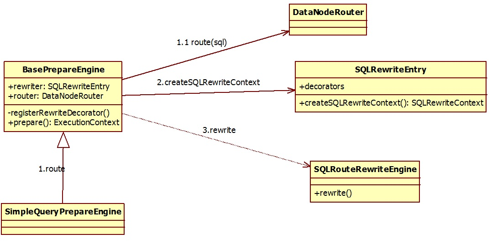
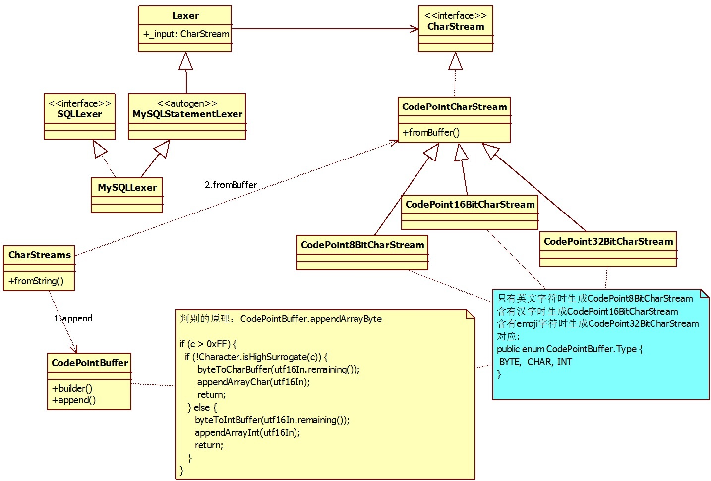

# Sharding-JDBC在处理含有Emoji字符的insert时报错

## 问题描述:
电商系统使用Sharding-JDBC做分库分表方案，当新增加的用户评论中含有Emoji字符时系统会报错：  
You have an error in your SQL syntax; check the manual that corresponds to your MySQL server version for the right syntax to use near ')' at line 1  
导致无法保存数据。  
对应的代码逻辑形如：  
```
sql1 = "insert into Ey_Order_Addr(ADDRNO,esmno,content) VALUES(18, 33232,'含有Emoji字符的内容')";
PreparedStatement pstm2 = conn.prepareStatement(sql1);
pstm2.execute();
```

若将代码修改为：  
```
sql1 = "insert into Ey_Order_Addr(ADDRNO,esmno,content) VALUES(18, 33232,'-')";
PreparedStatement pstm2 = conn.prepareStatement(sql1);
pstm2.execute();

String sql2 = "update EY_ORDER_ADDR set content= '含有Emoji字符的内容' where ADDRNO = 10  and esmno = 33232";
PreparedStatement pstm3 = conn.prepareStatement(sql2);
pstm3.execute();
```
则不会报错，数据可以正常插入以及更新  
  
为什么在insert的时候回报错， 而修改成update之后就正常呢？  
  
## Sharding-JDBC版本及配置:  
   
   
Sharding-JDBC版本4.1.1  
   
 
```
defaultDataSourceName: ms_ds_0
masterSlaveRules:
  ms_ds_0:
    loadBalanceAlgorithmType: ROUND_ROBIN
    masterDataSourceName: ds0_master
    name: ms_ds_0
    slaveDataSourceNames:
    - ds0_master
  ms_ds_1:
    loadBalanceAlgorithmType: ROUND_ROBIN
    masterDataSourceName: ds1_master
    name: ms_ds_1
    slaveDataSourceNames:
    - ds1_master
tables:
  ey_order_addr:
    actualDataNodes: ms_ds_${0..1}.ey_order_addr_${0..99}
```
   
   

## 原因分析:
Sharding-JDBC分片是通过SQL路由规则将用户表切分为物理分片表，  
SQL路由规则包括DB实例路由规则和表路由规则。  
以上述配置实例为例说明，DB实例由于将用户表切分到两个数据库实例中，每一个DB实例中又通过表路由规则切分为100个分片表。总共有2 * 100 = 200个分片。  
分片表对于上层用户逻辑是透明的，上层客户代码逻辑中SQL被Sharding-JDBC通过SQL解析引擎分拆又重新组转成分片表SQL。  
以上述问题SQL为例说明：  
insert into Ey_Order_Addr(ADDRNO,esmno,content) VALUES(18, 33232,'含有Emoji字符的内容')  
语句会被Sharding-JDBC的SQL解析引擎重新组转为  
insert into Ey_Order_Addr_32 (ADDRNO,esmno,content) VALUES(18, 33232,'含有Emoji字符的内容')  
该语句会被投放在第0个(33232 mod 2 = 0)数据库上执行。  
  
Sharding-JDBC的SQL解析引擎，由三部分逻辑组成（代码逻辑在BasePrepareEngine.java中）  
1)route:客户端SQL语句分析  
2)createSQLRewriteContext:根据SQL语法树生成SQLToken  
3)rewrite根据SQLToken生成分片SQL语句  

  
第一部分SQL语句的分析核心逻辑在SQLParserEngine::parse中；它由词法分析MySQLLexer和语法分析MySQLParser两部分组成，分析的底层基于antlr4完成  
完成分析后系统会记录每一个单词的起始地址(startIndex)和终止地址(stopIndex)  
  
第三部分rewrite根据SQLToken生成分片SQL语句，核心代码位于AbstractSQLBuilder::toSQL中  
它的核心逻辑就是通过第一部分解析到的startIndex和stopIndex  
然后以 result.append(context.getSql().substring(0, ...));的形式拼接成一条新的SQL语句。  
  
问题就出在startIndex、stopIndex和length、substring的数值上。  
  
Emoji字符集属于Unicode补充字符集。  
第一部分基于antlr4分析SQL时，它考虑的Unicode补充字符集问题，它把一个Emoji字符看做是1个长度的字符。  
而在第三部分rewrite时没有考虑Unicode补充字符集问题，涉及String的length和substring把一个Emoji字符看做是2个长度的字符，造成为切分错位，拼接了一个非法的insert语句，因而执行失败。  
  
那为什么insert会出现问题，而update语句正常呢？原因有两个。  
第一：SQL的route和rewrite最重要的一个逻辑就是要根据分片字段值找到具体的分片表，而insert语句的分片字段值位于values中，而update的分片字段值在where中。  
第二：正是由于insert和update分片字段值的位置不同，在SQL路由第二部分根据SQL语法树生成SQLToken时update会将这个错位修整，而insert则需要从整个values中通过substring的方式解析出分片字段值，因而引发错误的发生。  
  
## 解决方案：
出错的根源在于route和rewrite对待Unicode补充字符集不一致造成的，rewrite中拼接SQL时是引用route中生成的startIndex、stopIndex数值，因此修改要在route中完成。  
route中通过antlr进行词法解析时，读取SQL的动作核心类如下图所示：  

如图所示:antlr词法解析器在处理unicode字符集时区分了是否为unicode补充字符集使用java内置方法java.lang.Character.isHighSurrogate()  
通过Character.isHighSurrogate()将字符分为三种ascii码字符BYTE、Unicode字符CHAR、Unicode补充字符INT。  
修改方案是取消对Unicode补充字符的处理，将其视为2个普通的Unicode字符。     
仿照antlr中CharStreams.fromString的逻辑，新写一个去掉unicode补充字符集的特殊处理。  
增加了7个类，(即：仿照antlr中CharStreams.fromString的逻辑，新写一个去掉unicode补充字符集的特殊处理)  
MyCharStreams.java  
MyCodePoint16BitCharStream.java  
MyCodePoint8BitCharStream.java  
MyCodePointBuffer.java  
MyCodePointBufferBuilder.java  
MyCodePointCharStream.java  
MyCodeType.java  
  
Sharding-JDBC对CharStreams的调用在:
```
package org.apache.shardingsphere.sql.parser.core.parser;
...
public final class SQLParserFactory {
    private static SQLParser createSQLParser(final String sql, final SQLParserConfiguration configuration) {
        Lexer lexer = (Lexer) configuration.getLexerClass().getConstructor(CharStream.class).newInstance(CharStreams.fromString(sql));
        return configuration.getParserClass().getConstructor(TokenStream.class).newInstance(new CommonTokenStream(lexer));
    }
}
```
将其修改为
```
    private static SQLParser createSQLParser(final String sql, final SQLParserConfiguration configuration) {
        Lexer lexer = (Lexer) configuration.getLexerClass().getConstructor(CharStream.class).newInstance(MyCharStreams.fromString(sql));
        return configuration.getParserClass().getConstructor(TokenStream.class).newInstance(new CommonTokenStream(lexer));
    }
```
所有的修改位于shardingsphere-sql-parser-engine的org.apache.shardingsphere.sql.parser.core.parser中
修改之后重新编译源代码，只需要将心生成的shardingsphere-sql-parser-engine-4.1.1.jar替换即可。