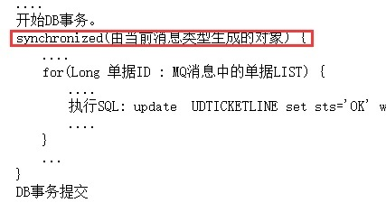
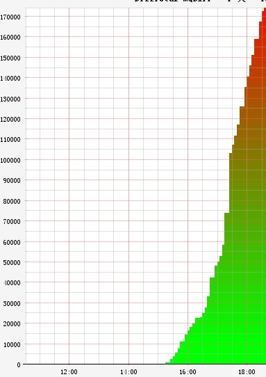
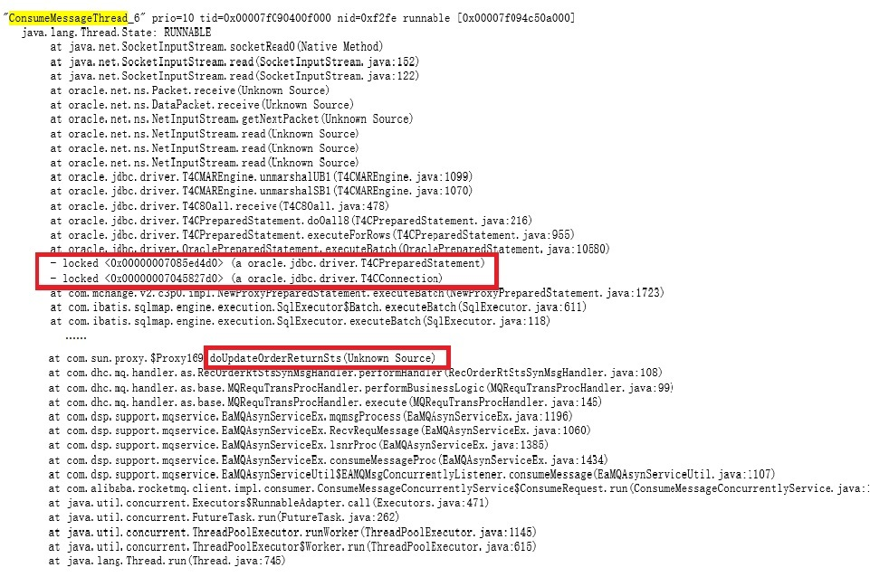
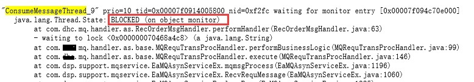
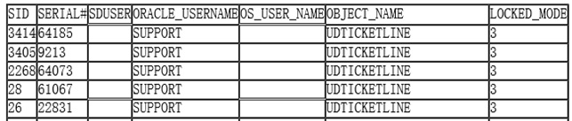
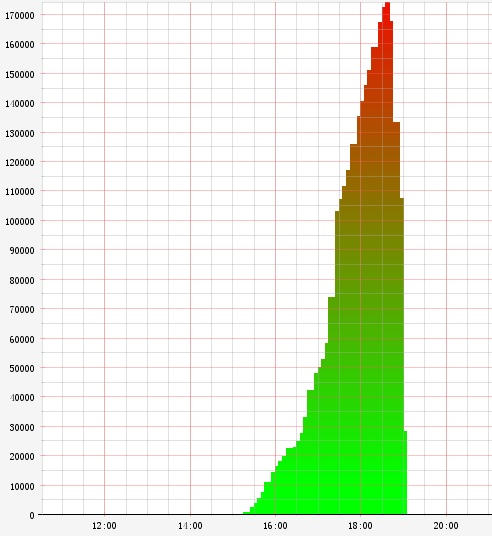

# 慎用synchronized: 一次错误synchronized使用导致的数据库死锁  

## 业务场景 
看如下的业务示例伪代码：  
```
class RecOrderRtStsSynMsgHandler extends ... {
  protected void performHandler() {
    ....		
    开始DB事务。
    synchronized(由当前消息类型生成的对象) {
      ....	
      for(Long 单据ID : MQ消息中的单据LIST) {
        ....
        执行SQL: update UDTICKETLINE set sts='OK' where 单据id=? and sts='READY';
        ....
      }
      ...	
    }
    DB事务提交
  }
}
```
  
- 1.这是个MQ消息处理Handler,每当有对应类型的消息生成时，框架就会自动调用RecOrderRtStsSynMsgHandler进行消息的处理。这个伪代码就是这个Handler的业务处理逻辑。    
- 2.框架设置有Handler线程池，线程池的大小为20。  
- 3.这个Handler的触发逻辑：业务系统单据状态发生变化时，就会发出消息通知当前系统要更新单据对应的状态，若业务系统一次更新多个单据状态，它会打包成一个消息。

    
结合实际的业务考虑如下业务场景:  
|  | RecOrderRtStsSynMsgHandler处理 | 业务逻辑B |  
| :--- | :---: | ---: |
| t0时刻 | 接受到一个消息，内含AB两个单据<br>List.get(0)为A单据<br>List.get(1)为B单据 | 启动事物<br> 开始处理单据B和A |  
| t1时刻 | 执行SQL update A单据状态 | 更新B单据数据 |  
| t2时刻 | 执行SQL update B单据状态 | 更新A单据数据 |  
  
  
这是一个典型的死锁场景：  
  - RecOrderRtStsSynMsgHandler处理在等待B数据行的锁被释放；	  
  - 业务逻辑B在等待A数据行的锁被释放。  
  
基于此业务场景，RecOrderRtStsSynMsgHandler处理逻辑会引发了如下的连锁反应：  
由于执行SQL语句前，Handler按照消息类型加一个synchronized锁，因此当有同种类型的消息到达时也很快被阻塞在：  
  
于是Handler的线程池很快被耗光，且不能被释放。其他类型的消息也得不到处理。因此就出现了消息的挤压。  
  
此时用java命令jatack观察java的调用栈也会发现：有一个Handler线程信息如下：  
   
其他线程池任务的状态全部为BLOCKED  
   
BLOCKED的原因是在等待"- waiting to lock <0x000000070468a4c8> (a java.lang.String)" 也就是synchronized锁  
此时观察数据库已锁信息：  
```
select 
  sess.sid, sess.serial#, sess.CLIENT_IDENTIFIER sduser, 
  lo.oracle_username, lo.os_user_name, ao.object_name, lo.locked_mode 
from 
  v$locked_object lo, dba_objects ao, v$session sess 
where 
  ao.object_id = lo.object_id and lo.session_id = sess.SID
```
  
也会看到有该表的锁：  
   
  
## 问题分析
	造成这些问题的根源有两个:  
	1.数据操作的不合理，造成了资源的死锁。  
	2.synchronized锁的不合理使用。  

	1是根本原因，2放大了1造成的后果，使得结果的雪崩。  

## 解决方案
1.应急解决方案：  
问题是发生在生产系统，所以首先要解决MQ消息挤压的问题，以避免对业务系统的扩大影响。根据上述分析，只要将DB死锁去掉就可以释放Handler线程池资源。Handler线程池资源释放了，挤压的MQ消息也就会被处理掉。  
根据查询到的数据库已锁信息，使用alter system kill session直接将阻塞的session干掉。挤压的MQ消息很快就处理掉了。  
   
  
应急方案的遗留问题：  
阻塞的session被强行kill掉，那么这个session锁对应的那个业务单据处理逻辑也就会异常终止，会造成这个单据处理的异常。必须要修改这个单据的数据。  
由于系统内对于处理失败的单据，自研发的MQ框架会自动在5分钟后重新处理，因此也就不用担心异常单据的产出。若没有自动补偿的机制，必须要考虑人工的修复。  
  
2.逻辑层的优化   
2.1解决DB死锁的问题:通用的解决方案可以参考银行家算法的思路。结合实际业务系统，优化思路有两点：  
2.1.1 整个系统对对于同一种单据做批量事务性操作前按照一个固定规则【规则不限，只要系统内采用同一个标准即可，比如按照单据的流水号】进行排序, 排序之后再进行事务操作，这样就不会造成相互之间锁等待的问题。  
以上述为例，系统都按照单据流水号进行排序，排序之后的处理：  
  
|  | RecOrderRtStsSynMsgHandler处理 | 业务逻辑B |  
| :--- | :---: | ---: |
|  | 按单据流水号排序,<br>排序后单据处理次序为AB | 按单据流水号排序,<br>排序后单据处理次序为AB |
| t0时刻 | 接受到一个消息，内含AB两个单据<br>List.get(0)为A单据<br>List.get(1)为B单据 | 启动事物<br> |  
| t1时刻 | 执行SQL update A单据状态 | 更新A单据数据 |  
| t2时刻 | 执行SQL update B单据状态 | 更新B单据数据 |   
那么两个任务同时锁A单据，在DBMS上肯定会一先一后，这样另一个在阻塞有限的时间后也会的到处理，不会造成死锁。

2.1.2 更新数据前，增加for update nowait锁。这样可以使得资源不会出现锁等待问题，对于异常的单据可以再通过补偿机制来处理，例如上述讲到的
MQ框架5分钟自动处理失败单据。

2.2 造成死锁问题被放大的根源是synchronized锁的不合理使用  
当前系统中synchronized使用不合理的原因为：  
- 1）临界区内有阻塞IO的存在；  
- 2）从业务逻辑上分析使用不合理。
    
此点见2.2.1的分析， 对应的解决方案：  
2.2.1 此处使用synchronized,开发人员的初衷是为了防止单据流水号的重复，分析此处代码后并没有此种场景的处理，因此可以去掉synchronized。  
2.2.2 若逻辑上需要生成流水号，建议使用sequence生成主键，或者使用主键自生成策略来替代synchronized。  
2.2.3 若逻辑上必须使用synchronized，尽量在临界区不要用IO操作的逻辑，使得临界区逻辑短小且多为内存操作。且必须要考虑一个问题：集群环境下如果应对synchronized中的逻辑。  

实践：根据上述的优化思路，实际生产系统采用了2.1.1、2.1.2和2.2.1的方案优化了代码，经过实际压测之后，再无上述问题发生。系统运行稳定。
