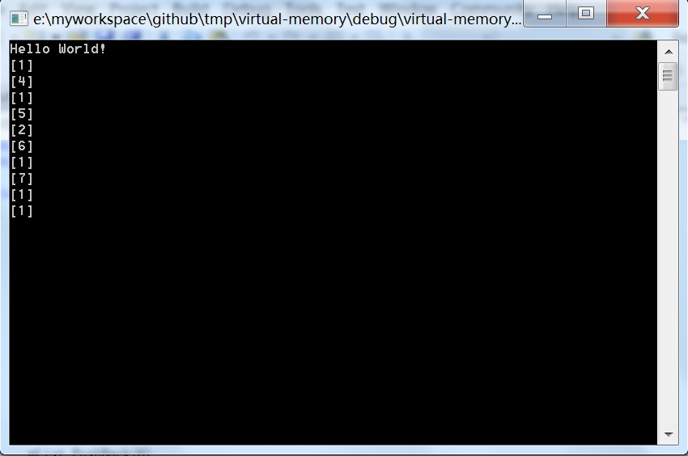

# 虚拟内存的模拟C++实现

好久之前写的一个文档了，最初贴在了https://blog.csdn.net/truelie007/article/details/2611624  
又翻出来看了看，里面的代码有点乱，顺手又整理了一下。  
  
考虑到以前遇到的一个问题，使用std::vector进行数据的存储，如果存储的数据量多大或者是没有足够的内  
存时该何如处理，联想到学习OS 时虚拟内存的概念，感觉是一个好的解决方法，于是动手写了一个小的程序实现了该想法。

## 设计思路
只在内存中保留指定数量的最近使用的数据，其余的数据保存到一个文件中，如果访问的数据在存储中则直接从内存中提取即可，如果没有在内存中首先要将数据Load到内存中，该代码同时考虑到了，内存和文件之间交换效率的问题，例如：  

现在在内存中的数据范围为[10,20]，我需要访问的第8个元素，首先假定第8个元素周围的元素近期将会被频繁的访问，因此在Load的数据同时将其周围的元素Load到内存中，因此需要将[8-10/2,8+10/2]这个范围的数据Load到内存中，但是[10,13]这个范围的数据已经在内存中了，所以只需要将[3,9]这个范围内的数据Load到内存中即可。  

## C++代码实现
  
### MyQueue.h
```

// MyQueue.h: interface for the CMyQueue class. 
// //////////////////////////////////////////////////////////////////////

#ifndef _MYQUEUE_H_INCLUDED_ 
#define _MYQUEUE_H_INCLUDED_

/*  有长度限制的FIFO .  当插入的元素超过指定长度时，则覆盖头部元素。 */ 
template<class T> class MyQueue  { 
public:  
	MyQueue(int Len) {
		mi_MaxLen = Len;
		Clear();
		mp_List = new T[mi_MaxLen];
	}; 
	
	virtual ~MyQueue() {
		Clear();
		if(mp_List != NULL) {
			delete [] mp_List;
		}
	};

	void Offset(int offset) {
		mi_HeadPtr = (mi_HeadPtr + offset) % mi_MaxLen;
		mi_TailPtr = (mi_TailPtr + offset) % mi_MaxLen;

		if(mi_HeadPtr < 0) {
			mi_HeadPtr = mi_MaxLen + mi_HeadPtr;
		}

		if(mi_TailPtr < 0) {
			mi_TailPtr = mi_MaxLen + mi_TailPtr;
		}
	}

	int Len() {
		return mi_EleNum;
	}

	void Clear() {
		mi_EleNum = 0;
		mi_HeadPtr = 0;
		mi_TailPtr = 0;
	};

	/*   插入元素  */  
	void PushBack(const T & t) {   
		mp_List[mi_TailPtr] = t;   
		mi_TailPtr = (mi_TailPtr + 1) % mi_MaxLen;     
		if(mi_EleNum < mi_MaxLen) {
			mi_EleNum++;
		}   
		else {
			mi_HeadPtr = (mi_HeadPtr + 1) % mi_MaxLen;   
		}  
	};	
	/*   提取元素  */  
	T & PopTail()  { 
		if(mi_EleNum <= 0)  
			return mp_List[0];  
		int nTmp = mi_HeadPtr; 
		mi_HeadPtr = (mi_HeadPtr + 1) % mi_MaxLen; 
		mi_EleNum--;
		return mp_List[nTmp];
	};    
	/*   随即访问  */  
	T & operator[] (int index)  {
		if(index < 0 || index > mi_MaxLen)  
			return mp_List[0];    
		int nTmp = (mi_HeadPtr + index) % mi_MaxLen; 
		return mp_List[nTmp];  
	};

protected:
	int mi_HeadPtr;
	int mi_TailPtr;
	int mi_EleNum;
	int mi_MaxLen;

	T * mp_List; 
};

#endif

```
  
### VMM.h
```
// VMM.h: interface for the CVMM class. 
// //////////////////////////////////////////////////////////////////////

#ifndef _MY_VMM_H_INCLUDED_
#define _MY_VMM_H_INCLUDED_

#include "MyQueue.h"

#define FNAME(T) #T 

/* 虚拟内存 的实现： 限制条件：  1.T类型数据要求定长  2.T类型数据支持memcpy memset操作 */ 
template<class T> class CVMM  {
public:
	CVMM(int nMemLen = 1024):mc_MemList(nMemLen) {
		mi_MemLen = nMemLen;
		Clear();
		mp_ReadPtr = NULL;
		mp_WritePtr = NULL;

		sprintf(ms_FileName, "%s_%04d.vmm", FNAME(T), sizeof(T));
		ClearFile();  
	};

	virtual ~CVMM() {
		Clear();
		CloseReadVmFile();
		CloseWriteVmFile();
	};

	void PushBack(const T & t)  {
		if(mi_RealLen < mi_MemLen)   {
			mc_MemList.PushBack(t);
			mi_RealLen++;
		}
		else if(mi_RealLen == mi_MemLen) {
			if(mi_FileLen <= mi_RangeMin)
				MemoryToFile(mc_MemList.PopTail());
			mc_MemList.PushBack(t);
			mi_RealLen++; 
			mi_RangeMin++;
		}
		else if(mi_RealLen > mi_MemLen) {
			if(mi_RealLen - mi_RangeMin == mi_MemLen) {
				if(mi_FileLen <= mi_RangeMin)
					MemoryToFile(mc_MemList.PopTail()); //写入文件
				mc_MemList.PushBack(t);
				mi_RealLen++;
				mi_RangeMin++;
			}
			else {
				mi_RealLen++; 
				mi_RangeMin = mi_RealLen - mi_MemLen;
				SuffixFtoM(mi_RealLen - mi_MemLen, mi_RealLen); 
				mc_MemList.PushBack(t);
			}
		}
	};    

	void Clear() {
		mi_FileLen = 0;
		mi_RealLen = 0;
		mi_RangeMin = 0;
		mc_MemList.Clear();
	};

	int Size() {
		return mi_RealLen;
	};

	T & operator [] (int index) {
		static T t(0);
		if(index < 0 || index >= mi_RealLen)
			return t;
		if(index >= mi_RangeMin && index < mi_RangeMin + mi_MemLen)
			return mc_MemList[index - mi_RangeMin];
		if(mi_FileLen < mi_RangeMin + mi_MemLen)
			MemoryToFile();

		int nAddr;

		if(index < mi_RangeMin) {
			nAddr = index - mi_MemLen/2;
			if(nAddr < 0)
				nAddr = 0;
			PrefixFtoM(nAddr, nAddr + mi_MemLen);
		}
		else if(index >= mi_RangeMin + mi_MemLen) {
			nAddr = index + mi_MemLen/2;
			if(nAddr >= mi_RealLen)
				nAddr = mi_RealLen;
			SuffixFtoM(nAddr - mi_MemLen, nAddr);
		}
		return mc_MemList[index - mi_RangeMin];
	}; 

protected:
	void ClearFile()  {
		CloseReadVmFile();
		CloseWriteVmFile();
		mp_WritePtr = fopen(ms_FileName, "w");
		CloseWriteVmFile();
	}

	void CloseReadVmFile() {
		if(mp_ReadPtr != NULL) {
			fclose(mp_ReadPtr);
			mp_ReadPtr = NULL;
		}
	}

	void CloseWriteVmFile() {
		if(mp_WritePtr != NULL) {
			fclose(mp_WritePtr);
			mp_WritePtr = NULL;
		}
	}

	/*  没有考虑打开异常异常的处理  */  
	bool OpenReadVmFile() {
		CloseWriteVmFile();

		if(mp_ReadPtr != NULL)
			return true;
		mp_ReadPtr = fopen(ms_FileName, "rb");
		if(mp_ReadPtr == NULL)
			return false;
		return true;
	}; 
  
	/*  没有考虑打开异常异常的处理  */ 
	bool OpenWriteVmFile() {
		CloseReadVmFile();

		if(mp_WritePtr != NULL)
			return true;
		mp_WritePtr = fopen(ms_FileName, "ab");
		if(mp_WritePtr == NULL)
			return false;

		return true;
	};
	
	bool MemoryToFile() {
		int nIndex1 = mi_FileLen;
		int nIndex2 = mi_FileLen - mi_RangeMin;
		int nData;
		while(nIndex1 < mi_RangeMin + mi_MemLen) {
			nData = mc_MemList[nIndex2];
			MemoryToFile(nData);
			nIndex1++;
			nIndex2++;
		}
		return true;
	}

	bool MemoryToFile(const T & t) {
		OpenWriteVmFile();

		fwrite((char *)&t, sizeof(T), 1, mp_WritePtr);
		mi_FileLen++;

		return true;
	}

	bool PrefixFtoM(int nStart, int nEnd)  {
		if(nEnd <= mi_RangeMin) {
			//没有重合数据
			FileToMemory(nStart, nEnd);
		}
		else {
			FileToMemory(nStart, mi_RangeMin);
			mc_MemList.Offset(nEnd - mi_RangeMin);
		}

		mi_RangeMin = nStart;

		return true;
	}

	bool SuffixFtoM(int nStart, int nEnd)  {
		if(mi_RangeMin + mi_MemLen <= nStart) {
			//没有重合数据
			FileToMemory(nStart, nEnd);
		}
		else {
			FileToMemory(mi_RangeMin + mi_MemLen, nEnd);
		}

		mi_RangeMin = nStart;

		return true;
	}

	//[nStart, nEnd)
	bool FileToMemory(int nStart, int nEnd)  {
		OpenReadVmFile();
		if(nStart != 0)
			fseek(mp_ReadPtr, nStart * sizeof(T), SEEK_SET);
		T tmpEle;
		int nCount = nStart;
		int nSize;
		while(!feof(mp_ReadPtr) && nCount < nEnd) {
			nSize = fread(&tmpEle, sizeof(T), 1, mp_ReadPtr);
			if(nSize == 0)
				break;
			mc_MemList.PushBack(tmpEle);
			nCount++;
		}
		return true;
	}

protected:
	FILE * mp_ReadPtr;
	FILE * mp_WritePtr;
	char ms_FileName[512];
	MyQueue<T> mc_MemList;

	int mi_RealLen;
	int mi_FileLen;
	int mi_MemLen;
	int mi_RangeMin;
};

#endif

```

### virtual-memory.cpp
```
// virtual-memory.cpp : Defines the entry point for the console application.
//

#include "stdafx.h"
#include "VMM.h"

int main(int argc, char* argv[]) {

	printf("Hello World!\n");

	CVMM<int> mList(5);

	mList.PushBack(1);  
	mList.PushBack(2);  
	mList.PushBack(3);  
	mList.PushBack(4);  
	printf("[%d]\n",  mList[0]); //1  
	printf("[%d]\n", mList[3]); //4

	mList.PushBack(5);  
	printf("[%d]\n", mList[0]); //1  
	printf("[%d]\n", mList[4]); //5

	mList.PushBack(6);  
	printf("[%d]\n", mList[1]); //2  
	printf("[%d]\n", mList[5]); //6

	printf("[%d]\n", mList[0]); //1

	mList.PushBack(7);  
	mList.PushBack(8);  
	printf("[%d]\n", mList[6]); //7  
	printf("[%d]\n", mList[0]); //1

	mList.PushBack(9);  
	printf("[%d]\n", mList[0]); //1

	getchar();

	return 0;
}


```

### 运行结果
上述代码可直接贴出来运行，若要使用gcc编译器编译话只需要将virtual-memory.cpp的#include "stdafx.h"注释掉即可。
